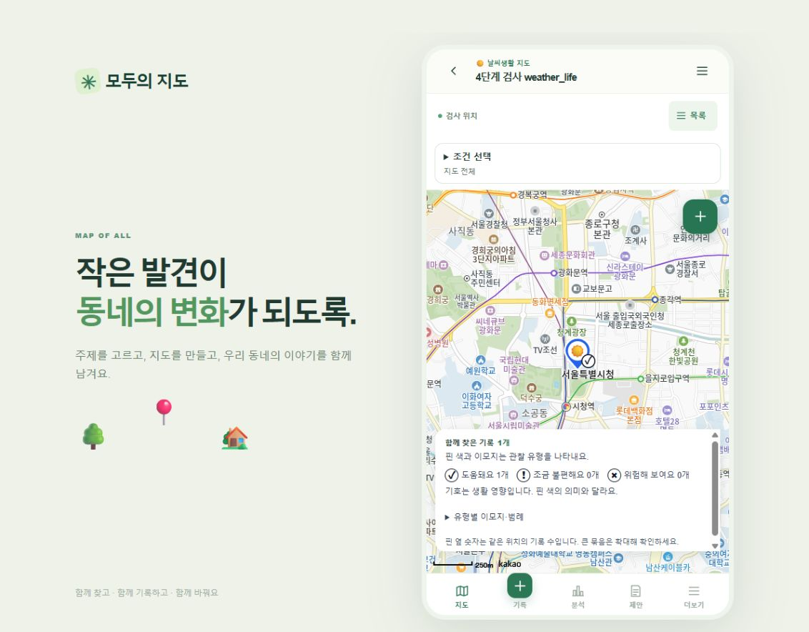

# 운영 앱 기능 점검 — 2026-10-01

대상: https://ai-town-map.vercel.app/ · 수정 배포 커밋: `9f0fa77`

사용자 요청에 따라 추가 유료 복원 환경 구축 대신 현재 구현된 앱 기능을 점검했다. 아래 자동 검사와 브라우저 확인 범위에서 통과했다. 실제 Android 기기까지 모든 환경의 동작을 보증하는 결과는 아니다.

## 발견하여 수정한 오류

1. 운영 서버에서 초대 코드 참여가 `503 INVITE_LIMIT_NOT_CONFIGURED`로 실패했다. Vercel 환경에서는 신뢰할 수 있는 `x-vercel-forwarded-for`를 사용하도록 수정했다. 다른 운영 환경은 명시적 프록시 설정을 요구하며 기존 시도 횟수 제한을 유지한다.
2. 수정 요청이 DB에 반영된 뒤 Vercel에서 잘못된 HTTP 412를 반환했다. 애플리케이션 버전 검증을 `If-Match` 대신 `X-Resource-Version`으로 전달하여 CDN의 HTTP 조건부 요청 처리와 충돌하지 않게 했다. 실제 오래된 버전의 수정 요청은 계속 412로 거부한다.

두 수정은 GitHub에 반영했고 Vercel 배포 성공을 확인한 뒤 운영 API 검사를 다시 실행했다.

## 검사 결과

| 범위 | 결과와 확인 내용 |
| --- | --- |
| 자동 테스트 | 7개 파일, 40개 테스트 통과 |
| 정적 검사·빌드 | TypeScript 검사, 프로덕션 빌드, diff 공백 검사 통과 |
| DB 스키마 | PGlite에서 22개 앱 테이블, 권한, 지도 간 이모지 참조 제약 검사 통과 |
| 30일 만료 정리 | PGlite에서 기간 경계, 종속 자료, 반복 실행, 실행 권한 검사 통과. 실제 사용자 데이터를 만료시켜 삭제하지 않음 |
| 운영 phase3 | 다섯 주제, 세션, 검색·페이지 분할, 코드·닉네임 입장, 만료·취소·소진·보관·차단 조건 통과 |
| 운영 phase4 | 주제별 이모지·평가·핀 규칙, 중복 등록 방지, 지도 간 격리, 수정·버전 충돌, 사진 변환·조회·실패 처리, CSRF·Origin 검사 통과 |
| 운영 phase5 | 검토·수정 요청·승인·숨김·복구, 댓글 수정·삭제·등록 제한, 신고, 권한·차단, 설정 변경, 지도 삭제·복구 통과 |
| 운영 phase6 | 필터·날짜·통계 분모, CSV 이스케이프, 제안서 작성·개정·제출·검토·공개·공개 해제, 비공개 제외, 기능 설정 통과 |
| Google 로그인 | 사용자가 선택한 계정으로 새 OAuth 로그인, 새로고침 후 세션 유지, 로그아웃 확인 |
| 브라우저 화면 | 지도 생성 마법사의 주제별 설정·미리보기, 카카오 지도 타일, 날씨 이모지 핀·범례, 목록·상세 기록, 통계 화면 확인. 사용자 지도는 새로 만들거나 수정하지 않음 |

운영 검사는 별도 합성 사용자·지도·기록으로 실행했으며 종료 후 정리했다. 점검 전후 주요 행 수는 동일하다: 사용자 2, 지도 2, 기록 2, 사진 2, 댓글 0, 제안서 0. 새 로그인에 필요한 세션 변경은 이 비교에서 제외한다.

## 이번 검사로 확인하지 못한 범위

- 실제 Android GPS 정확도·권한 처리, 카메라 촬영, 터치 제스처, TalkBack, 앱 설치와 OS 공유·인쇄 흐름.
- 브라우저 화면 크기 설정은 시도했으나 저장된 화면이 데스크톱 레이아웃이므로 실제 390px 반응형 검증 완료로 계산하지 않는다.
- 실제 프린터/PDF 저장 결과, 장기간 운영 부하, 예약된 정리 작업의 미래 실행, Supabase 물리 백업 복원.

아래 화면은 합성 날씨생활 지도에서 확인한 카카오 지도와 핀이다. 화면 캡처 후 합성 데이터를 정리했으므로 해당 지도는 현재 목록에 남아 있지 않다.

