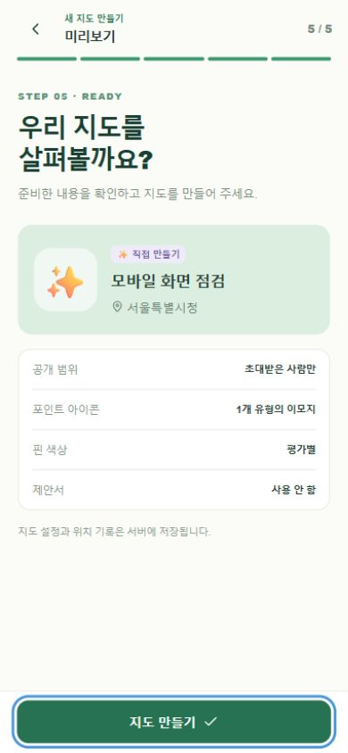
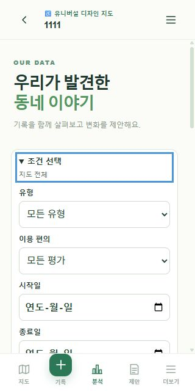

# 모바일 화면 추가 점검 — 2026-10-01

대상: https://ai-town-map.vercel.app/ · 앱 수정 기준 `9f0fa77`, 점검 시작 저장소 `ba6a271`.

기능 점검 이후 남았던 좁은 화면 검증을 진행했다. Codex 인앱 브라우저의 화면 크기를 변경하고 DOM의 실제 가로 크기와 스크린샷을 함께 확인했다. 실제 Android 기기 검사는 아니다. 신규 서버 데이터는 생성하지 않았으며 기존 지도·기록도 수정하지 않았다.

| 화면 크기 | 과업 | 결과 |
| --- | --- | --- |
| 360×800 설정 | 홈, 공개 지도 열기 | DOM 가로 폭/내용 폭 모두 360px. Kakao 타일·출처, 범례, 하단 메뉴 표시 |
| 320×640 | 분석·필터 펼치기 | DOM 가로 폭/내용 폭 모두 320px. 유형·평가·기간 입력 표시, 세로 스크롤로 이용 가능 |
| 320×640 | 직접 만들기 1–3단계 | 주제 선택, 이름·지역 입력, 장소 검색, 분류와 이모지 추가, 평가색 선택 정상. 가로 넘침 없음 |
| 390×844 | 참여 설정·미리보기 | DOM 가로 폭/내용 폭 모두 390px. 초대 전용, 이모지 1개 유형, 평가별 핀, 제안서 사용 안 함이 미리보기에 일치 |
| 800×360 | 미리보기 가로 배치 | 스크롤바 제외 문서 폭/내용 폭 모두 785px. 세로 스크롤 후 최종 버튼 위 294px·아래 342px로 화면 안에 표시 |

장소 검색은 `서울시청` 입력 후 지역이 `서울특별시청`으로 변경되는 것을 확인했다. 직접 만든 분류 `동네 쉼터`에 🪑 이모지를 배정하고, 평가별 색을 고르면 설명과 미리보기가 함께 바뀌었다. 마지막 ‘지도 만들기’ 버튼은 제출하지 않았다.

이번 범위에서 재현된 기능 오류나 가로 넘침은 없었다. 런타임 코드는 변경하지 않았다. 종료 시 화면 크기 설정을 해제하고 새로고침하여 저장하지 않은 입력을 정리했다.

## 남은 실제 사용 확인

실제 Android의 GPS·위치 권한, 촬영·사진 선택, 가상 키보드, TalkBack, 회선 단절·복구, OS 공유·PDF 저장은 이번 결과로 통과 처리하지 않는다. [파일럿 기록지](PILOT_CHECKLIST.md)를 사용해 확인한다. 유료 복원 연습은 사용자 요청에 따라 제외된 상태이며 AI 분석은 별도 후속 개발 범위다.

