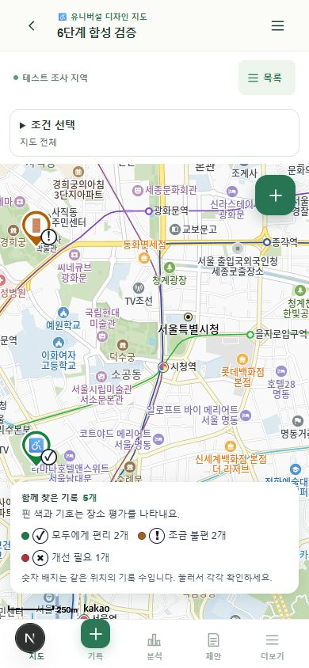
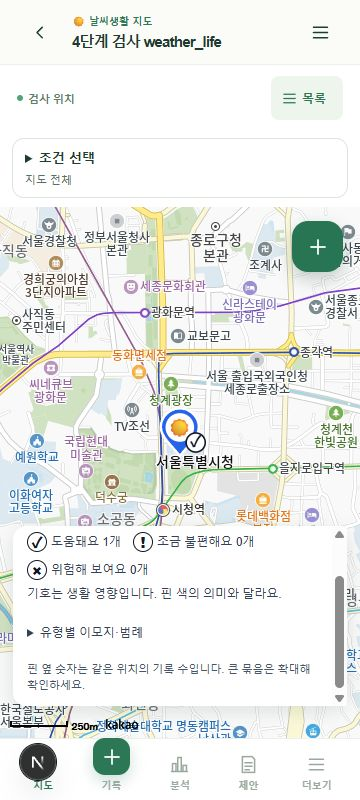

# 7단계 추가 검토 — 핀·범례와 평가 의미

검토일: 2026-09-29. 코드·자동 검사와 360/390px 인앱 브라우저 확인. 실제 Android/TalkBack 또는 색각 사용자 검증을 대체하지 않는다.

## 표시 규칙

- 모든 개별 위치 핀에 원래 주제의 이모지를 유지한다. 평가를 사용하는 지도에만 평가 기호를 흰 바탕·어두운 글자/테두리 배지로 추가한다. 기본 기호는 ✓, !, ×이며 주제별 실제 문구를 함께 사용한다.
- 유니버설 디자인/안전 지도는 평가색과 기호를 병행한다. 생태 지도에는 평가 표시를 넣지 않는다. 날씨 지도는 분류색·이모지와 생활 영향 기호를 분리하고 범례에 두 의미를 설명한다. 단일색 지도에는 ‘이모지로 관찰 유형 구분’이라고 안내한다.
- 평가 기능이 있는데 값이 누락되거나 알 수 없으면 ?/평가 없음으로 표시한다. 유리한 평가로 추정하지 않는다.
- 동일 좌표의 여러 기록은 중립색·숫자 배지를 사용한다. 대표 기록의 평가를 전체 위치의 평가처럼 표시하지 않으며, 눌러 모든 기록의 제목과 개별 평가를 선택한다. 넓은 영역의 클러스터는 확대해 확인하도록 설명한다.
- 목록·상세·등록 확인·분석·필터에서도 평가 기호와 문구를 확인할 수 있다. 목록 버튼의 접근성 이름에는 제목·유형·이모지 의미·평가를 포함한다. SDK 지도 핀의 보조기술 지원을 단정하지 않고 ‘기록 목록 보기’를 대체 경로로 제공한다.
- 범례는 작은 화면에서 내부 스크롤이 가능하고 분류 범례는 접을 수 있다. 새 기록 버튼을 상단으로 옮겨 범례와 겹치지 않게 했다. 지도 출처 표시는 유지한다.

## 검증

- 단위 검사 총 29개. 추가 6개는 주제별 평가 의미, 평가 미사용, 날씨 분류색 보존, 미평가 표시, 겹친 좌표의 평가 오해 방지, 사용자 이모지/기호의 SVG 이스케이프를 확인한다.
- TypeScript와 프로덕션 빌드 통과.
- 4·6단계 실제 API 회귀 검사 통과. 임시 합성 지도를 브라우저 확인 후 정리했다. `PHASE4_UI_CHECK=1` 옵션은 해당 실행의 합성 지도만 확인용으로 열고, 표시 파일 제거 또는 최대 10분 뒤 기존 정리를 이어 간다.
- 390×844: 평가 핀·범례 시각 확인, 키보드 Enter로 목록 → 상세, Escape로 닫은 뒤 원래 목록 버튼으로 초점 복원 확인.
- 360×800: 문서 가로 넘침 없음. 생태 지도에 평가 범례가 없고, 겹친 기록 숫자 핀에서 두 기록을 모두 선택할 수 있음. 날씨 지도에서 분류 범례와 생활 영향 기호 설명 확인.

## 남은 범위·다음 작업

전체 WCAG 준수 또는 실제 색각/TalkBack 과업 통과로 판정하지 않는다. 실제 기기에서 지도·목록·상세의 탐색, 확대와 큰 글꼴, VoiceOver/TalkBack 확인이 남아 있다.

다음 작업은 성능 기준 측정과 파일럿 준비 점검이다. 측정·개별 개선은 GPT-6 Sol / High, 출시 여부를 포함한 통합 검토는 GPT-6 Astra / High를 권장한다. 실제 모델 전환을 의미하지 않는다.

참고: [W3C 색 사용 지침](https://www.w3.org/WAI/WCAG22/Understanding/use-of-color.html)은 색상 외 기호·문구로 정보를 함께 전달하는 구현의 근거다. 이 한 항목의 보완을 전체 접근성 인증으로 간주하지 않는다.
