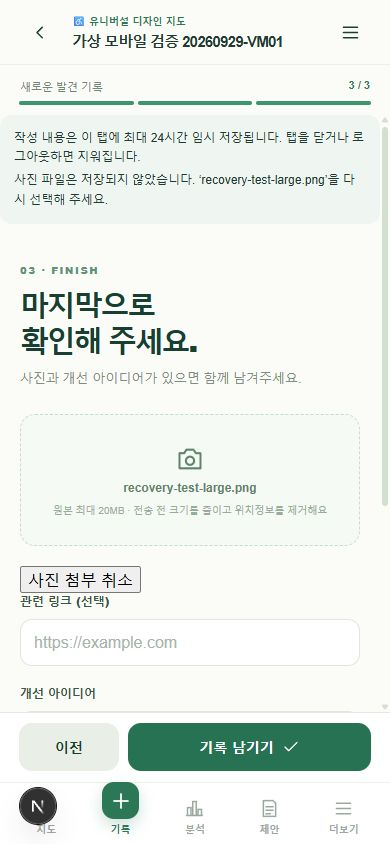

# 7단계 추가 검토 — 사진 전송과 초안 복구

검토일: 2026-09-29. 구현·자동/API·모바일 크기 브라우저 검사 완료. 전체 7단계 인수 완료를 의미하지 않는다.

## 동작

- 원본 20MiB 이하 사진을 브라우저에서 JPEG로 변환한다. 긴 변 최대 1,600px, 전송 최대 1,500KiB이며 JPEG 품질을 단계적으로 낮춰 용량을 제한한다. 서버도 별도로 WebP 변환과 위치 메타데이터 제거를 수행한다.
- 준비 중, 전송 %, 전송 완료 후 서버 처리 중, 성공/실패를 구분한다. 90초 전송 제한과 중복 재시도 방지, JSON이 아닌 호스팅 오류·로그인 만료 안내를 추가했다.
- HEIC는 브라우저가 읽을 수 있는 경우에만 변환한다. 읽지 못하면 JPG/PNG를 선택하도록 안내하며 지원한다고 일괄 주장하지 않는다.
- 본문을 먼저 저장하고 사진만 실패하면 기록을 새로 만들지 않는다. 같은 탭에서는 기존 파일로 재시도하고, 새로고침 후에는 ‘사진 이어 올리기’에서 파일을 다시 선택한다. 동일 사진의 재전송은 기록 버전과 검수 상태를 다시 바꾸지 않는다.
- 작성 단계·제목·본문·좌표·평가·질문·링크·아이디어는 같은 탭에 임시 보관한다. 사용자·지도·새 기록/수정 기록별로 분리하고 24시간 이내 복구한다. 비밀번호·쿠키·CSRF·사진 파일은 저장하지 않는다. 성공·사용자 삭제·로그아웃 시 정리한다.
- 새 기록의 응답 유실에는 요청 키와 본문을 보존한다. 결과가 불명확할 때 본문 변경을 막아 같은 요청을 재시도한다. 수정 요청은 기존 version으로 재시도하므로, 이미 저장됐다면 412로 멈추고 현재 기록을 확인해야 한다.
- 다른 계정의 초안을 표시하지 않는다. Google 계정의 동일 principal은 로그인 갱신 후 같은 범위를 사용한다. 만료 뒤 새 principal로 들어온 게스트 초안을 이전 참여자와 연결하지 않는다.

## 확인한 근거

- 단위 검사 23개: 기존 14개 + 복구 형식·만료·좌표 검증·계정/지도/수정 분리·공간 부족·사진 한도·전송 이벤트·413/401/503/연결 끊김 모의 검사 9개.
- 4단계 실제 API: 네 주제 기록, 사진 변환과 동일 사진 재시도의 version 유지, 권한·중복 제출·이모지 설정 회귀 통과.
- 5·6단계 실제 API: 검수·댓글·신고·지도 운영·제안 기능·근거와 공유 권한 회귀 통과. API 합성 데이터 정리 완료.
- 인앱 브라우저 390×844: 비공개 합성 지도에서 초안 입력 → 8.3MB 합성 PNG 선택 → 1.24MB JPEG 준비 → 새로고침 → 제목/본문/위치/평가와 3단계 복구 → 사진 재선택 → 저장/사진 조회 성공 → 새로고침 후 임시 안내 제거 확인. 기존 기록 1개에 새 기록 1개만 추가됐다.
- TypeScript 및 프로덕션 빌드 통과.

## 범위와 다음 작업

실제 Android 에뮬레이터/기기, 실제 카메라 원본, OAuth 재인증 왕복, 셀룰러 통신 단절은 이번 브라우저 검사로 대체하지 않는다. 사진 파일은 새로고침 후 다시 골라야 하며 다른 탭/기기 동기화는 제공하지 않는다. 브라우저가 임시 저장을 차단하면 화면 안내를 표시한다.

다음은 평가 의미를 색 이외의 기호로 지도·범례 전반에 표시하고 접근성을 검토하는 작업이다. 구현은 GPT-6 Sol / High, 통합 검토는 GPT-6 Astra / High를 권장한다. 모델 권장은 실제 실행 모델 변경을 뜻하지 않는다.

## 구현 참고

- [Vercel Functions 제한](https://vercel.com/docs/functions/limitations): 사진을 함수 요청 전에 줄이는 근거.
- [MDN XMLHttpRequest.upload](https://developer.mozilla.org/en-US/docs/Web/API/XMLHttpRequest/upload): 전송 진행 이벤트와 최종 서버 응답의 구분.
