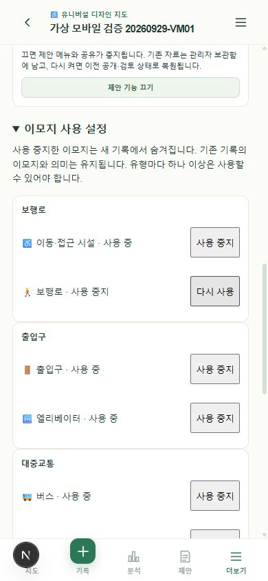

# 7단계 추가 검토 — 제안 기능과 이모지 설정

검토일: 2026-09-29. PRD 인수 기준 23·26 구현 및 자동/API·모바일 크기 브라우저 확인.

## 변경 내용

지도 관리자 화면의 **더보기 → 기능과 이모지 관리**에서 제안 기능과 이모지 사용 여부를 변경한다.

제안 기능을 끄면 제안 메뉴·일반 조회·공유·생성·수정·검토·삭제를 중지한다. 관리자는 보관함에서 기존 초안·검토본·확정본을 읽을 수 있고 공유 링크나 편집 버튼은 제공하지 않는다. 다시 켜면 각 제안서의 상태와 확정본 포인터가 그대로 복원된다. 기존 접근 권한과 근거 열람 규칙은 계속 적용된다.

이모지를 중지하면 새 기록의 선택지에서 숨긴다. 기존 기록의 키·그림·의미는 유지하며, 그 기록을 수정할 때만 기존 비활성 이모지를 유지할 수 있다. 대표 이모지가 중지되면 활성 대안이 새 기본값이 된다. 유형의 마지막 활성 이모지는 중지할 수 없다.

두 설정은 개설자/관리자 권한, CSRF, 지도 version 일치를 검사한다. 지도 행 잠금으로 설정과 쓰기를 직렬화하고 감사 로그를 남긴다. 질문·평가 정의를 바꾸지 않아 configRevision은 유지한다. DB migration은 필요하지 않다.

## 검증

- 단위 검사 14개, TypeScript, 프로덕션 빌드.
- 4단계 API: 비로그인 차단, 오래된 version 거절, 비활성 이모지 신규 등록 거절, 기존 기록 수정 허용, 의미·기본값 보존, 마지막 활성 옵션 차단, 재활성화 후 등록.
- 5단계 API: 기존 검수·댓글·신고·지도 운영·동시 설정 변경 회귀.
- 6단계 API: 일반 참여자 설정 변경 거절, 보관함 권한, 비활성 상태의 공유/쓰기 차단, 관리자 읽기 전용 상세, 기존 초안/확정본 보존과 재활성화 후 공개본 복원. 기존 통계·CSV·제안서 회귀 포함.
- 인앱 브라우저 390×844: 제안 메뉴 숨김/복원, 관리자 빈 보관함, 이모지 중지/재활성화, 새 기록에는 활성 옵션만 표시, 기존 기록 상세와 편집에서 비활성 이모지·‘기존 기록용’ 문구 유지 확인. 새 검증 기록은 저장하지 않았다.
- API 합성 데이터는 검사 후 정리했다. UI 검증용 비공개 지도는 설정을 원상 복구하고 복구 가능한 삭제 상태로 돌려놓았다.

## 남은 범위

모바일 크기의 데스크톱 브라우저 검사이며 Android 에뮬레이터나 실기기 검증은 아니다. 실제 GPS·카메라·가상 키보드·TalkBack, 사진 업로드 복구와 성능 측정은 별도로 남아 있다. 전체 7단계 인수나 정식 출시 완료로 판정하지 않는다.

다음 작업은 사진 업로드 전 압축·진행 상태와 입력 초안 복구 보완이다. 구현은 GPT-6 Sol / High, 권한·장애 복구 통합 검토는 GPT-6 Astra / High를 권장한다. 이 표기는 실제 실행 모델 변경을 뜻하지 않는다.
