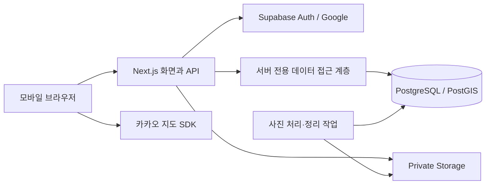

# 1단계 기술 설계

작성일: 2026-09-27 · 상태: 설계 완료, 3단계 로컬 기반 구현, 외부 서비스 설정 대기

## 1. 확정 결정과 문서 구성

사용자 확정: 개설자는 Google 로그인, 참여자는 초대 코드·닉네임, Next.js와 Supabase 사용. 앱의 AI 분석은 후속 범위다.

| 구성 요소 | 설계 선택 | 이유 |
|---|---|---|
| 웹·서버 | Next.js App Router + TypeScript, Node.js 런타임 | 모바일 화면과 같은 출처의 API를 하나의 프로젝트에서 관리 |
| UI | React, CSS 변수·반응형 스타일, 접근성 있는 기본 컴포넌트 | 주제별 화면과 바텀시트, 이모지·색상 의미를 분리 |
| 계정 인증 | Supabase Auth의 Google OAuth, 서버 PKCE 흐름 | 계정 인증 제공자를 직접 구현하지 않음 |
| 참여자 인증 | 서버 발급 불투명 세션 + 게스트 principal | 닉네임과 쓰기 권한을 분리하고 초대 가입만 허용 |
| 데이터베이스 | Supabase PostgreSQL + PostGIS | 지도별 관계·트랜잭션·공간 조회·집계 |
| DB 접근 | 서버 전용 PostgreSQL 연결과 SQL migration | 복합 외래키·공간 인덱스·원자적 저장 제어 |
| 사진 | Supabase Storage의 private 버킷 | 공개·비공개 전환과 기록 상태를 API에서 검사 |
| 지도 | Kakao Maps JavaScript SDK, services·clusterer | 장소 검색·지도·이모지 오버레이·군집 |
| 입력 계약 | TypeScript + Zod 검증, REST `/api/v1` | 클라이언트 도움말과 서버 검증 규칙 공유 |
| 검증 | Vitest로 도메인 규칙, Playwright로 주요 사용자 흐름 | 단계별 인수 기준의 반복 검증 |
| 배포 | Node 지원 호스팅, DB와 가까운 리전 | 공급자는 8단계 전 결정. 정적 호스팅만으로 운영 불가 |

패키지 버전은 구현 착수 때 호환되는 안정 버전을 확인해 lockfile에 고정한다. 이 단계에서는 패키지를 설치하거나 외부 프로젝트·유료 자원을 만들지 않는다.

- [데이터 스키마](DATA_MODEL.md): 필드·외래키·상태·인덱스·트랜잭션.
- [권한 설계](PERMISSIONS.md): 역할별 동작·조회 범위·파일 접근.
- [API 계약](API_CONTRACT.md): 경로·입력·응답·오류·페이지네이션.
- [주제 설정 예시](contracts/theme-presets.json): 2단계 샘플 화면과 이후 구현의 기준 데이터.
- [설계 검토 결과](STAGE1_REVIEW.md): 요구사항 대응과 남은 준비 항목.

## 2. 구성과 신뢰 경계



모든 앱 데이터 읽기·쓰기는 서버 API 또는 같은 서버 서비스 계층을 거친다. 브라우저가 앱 테이블을 직접 조회하지 않는다. 각 Route Handler에서 세션·지도 권한·기능 설정을 검사하고, 서버 컴포넌트도 같은 서비스 함수를 사용한다. 화면에서 버튼을 숨기는 것만으로 권한을 보장하지 않는다. Next.js는 Route Handler와 서버 함수의 개별 인가 검사를 요구한다. [인증 가이드](https://nextjs.org/docs/app/guides/authentication)

### 데이터베이스와 파일 경계

- 업무 테이블은 노출하지 않는 `app` schema, 세션·초대 비밀값은 `app_private` schema에 둔다. Supabase Data API의 exposed schema에 추가하지 않는다.
- `anon`, `authenticated`, `PUBLIC` 역할에 업무 테이블·함수 권한을 부여하지 않는다. 업무 테이블은 RLS를 켜고 이 역할들에 허용 정책을 만들지 않는다.
- 서버는 마이그레이션 소유자와 구분된 `app_backend` 역할로 연결한다. 이 역할은 서버 인가 후 데이터를 조회하는 신뢰 경계이며 필요한 테이블의 CRUD만 허용한다. 해당 역할용 RLS 정책은 테이블 접근을 허용하므로 **서버 요청자별 행 권한을 RLS가 대신 보장한다고 주장하지 않는다.** 지도·상태·작성자 필터는 필수 서버 정책이다.
- `app_backend`에 schema 변경·역할 변경·TRUNCATE·BYPASSRLS 권한을 주지 않는다. 운영자용 작업과 migration 자격증명은 별도 분리한다.
- SQL은 바인딩 매개변수로 작성한다. 저장소 함수는 `mapId`와 검증된 접근 범위를 인자로 받으며 무제한 테이블 조회 함수를 제품 코드에 노출하지 않는다.
- Storage 서비스 비밀키는 서버의 업로드·다운로드 어댑터에서만 사용한다. `storage.objects`에 일반 사용자용 직접 읽기·쓰기 정책을 만들지 않는다.
- RLS는 정책이 없으면 기본 거부하며 소유자·BYPASSRLS 역할은 별도 취급된다. 구현 시 실제 역할로 직접 API/DB 접근을 검증한다. [PostgreSQL RLS](https://www.postgresql.org/docs/current/ddl-rowsecurity.html)

## 3. Google 로그인과 게스트 세션

### 개설자

1. `/auth/google`에서 서버가 PKCE 로그인 흐름을 시작한다. 이동할 앱 경로는 허용된 상대 경로만 받는다.
2. Google → Supabase → 앱 callback에서 인증 코드를 교환하고, Supabase가 검증한 사용자 ID를 받아 `principals(kind=account)`와 연결한다.
3. 앱 자체 세션을 발급하고 인증 교환에 사용한 임시 쿠키·토큰은 정리한다. Google access/refresh token을 앱 DB에 보관하지 않는다.
4. 이후 앱 권한은 앱 세션과 DB의 membership으로 판단한다. 이메일 문자열이나 클라이언트가 보낸 역할을 신뢰하지 않는다.

Supabase가 Google OAuth와 PKCE 코드 교환을 지원한다. 앱 자체 세션은 본 프로젝트의 설계 선택이다. [Google 로그인 문서](https://supabase.com/docs/guides/auth/social-login/auth-google)

### 참여자

1. 코드와 닉네임을 `/invites/redeem`에 전송한다. 코드는 URL 조회 매개변수와 분석 로그에 기록하지 않는다. 링크·QR은 `/join#code=…`를 쓰고 페이지가 읽은 뒤 주소에서 제거한다.
2. 유효한 초대인지 먼저 검사한 뒤 기존 세션이 있으면 같은 principal을 사용하고, 없으면 guest principal을 생성한다.
3. 초대 만료·폐기·사용 한도를 잠금 안에서 재검사하고 membership 생성·사용량 증가·세션 생성을 원자적으로 처리한다. 실패 시 게스트 계정을 무제한 생성하지 않는다.
4. 초대 코드는 입장만 허용한다. 작성자 ID와 역할은 서버가 결정한다. 게스트는 개설자·관리자로 승격할 수 없다.

### 공통 세션 정책 — 초기 운영 기본값

- 암호학적 난수 32바이트 토큰. DB에는 SHA-256 해시만 저장한다. 쿠키는 `__Host-moa_session`, Secure, HttpOnly, SameSite=Lax, Path=/, Domain 미지정.
- 절대 만료 7일, 자동 연장 없음. Google 사용자는 재로그인해 기존 identity에 연결한다. 게스트는 만료·쿠키 삭제 시 기존 작성 권한을 자동 복구하지 않는다. 만료 시각과 한계를 참여 화면에 안내한다.
- 재로그인·로그아웃 시 토큰을 교체 또는 폐기한다. 계정 차단은 principal 상태를 확인해 모든 기존 세션에도 적용한다.
- Google 계정으로 로그인했다고 기존 게스트 기록을 자동 귀속하지 않는다. 게스트 자료는 기존 작성자로 남으며 계정 병합은 후속이다.
- 닉네임이 같아도 principal과 membership은 다르다. 학생 실명·전화번호는 요구하지 않는다.
- 상태 변경 요청은 Origin 검사와 세션 연동 CSRF 토큰 검사를 함께 수행한다. OAuth callback은 PKCE·요청 상관관계 검증을 사용한다. 초대 입장은 정확한 same-origin JSON 요청만 허용한다.
- 초대 실패 시 IP 기반 제한(학교 NAT 고려)과 코드·세션별 제한을 조합한다. 초기 한도는 운영 설정으로 분리하고 429와 재시도 시간을 반환한다.

## 4. 주제 구성의 단일 기준

주제 템플릿은 version이 붙은 불변 데이터다. 지도 개설 시 분류·이모지·평가·질문과 기능 값을 지도 소유 데이터로 복사한다. 샘플 파일의 문자열 key는 템플릿 내부 참조이며, 개설 트랜잭션에서 실제 지도별 UUID로 변환한다.

| 기능 | 독립 설정 | 불변 조건 |
|---|---|---|
| 핀 | `pinMode: rating/category/single` | rating 모드는 종합평가 사용 필수 |
| 이모지 | 분류별 default + 허용 목록 | 모든 주제·모드에서 포인트당 1개 필수 |
| 종합평가 | `ratingEnabled`, rating scheme | 꺼지면 observation.rating_option_id는 null |
| 질문 | 활성 question versions | 미응답/확인 못함/해당 없음 분리 |
| 아이디어 | `ideasEnabled` | 꺼지면 신규 입력을 받지 않음 |
| 제안서 | `proposalsEnabled` | 평가 없이도 독립 사용 가능 |
| 댓글 | `commentsEnabled` | 운영 정책과 지도 상태를 함께 검사 |

`GET /maps/{id}/configuration` 응답으로 지도·등록·상세·필터·분석·하단 메뉴를 구성한다. 서버도 같은 DB 설정으로 검증한다. 사용자가 화면을 조작해 꺼진 기능 값을 보내면 422로 거부한다. 단, 비활성 평가의 `ratingOptionId: null`은 허용한다.

첫 기록의 **제출**과 지도 설정 잠금을 같은 트랜잭션에서 처리한다. 제출 뒤 모든 기록이 삭제돼도 `theme_locked_at`을 해제하지 않는다. 질문 추가·비활성화는 새 configuration revision으로 관리한다. 클라이언트가 오래된 revision으로 저장하면 409를 반환하고 초안을 보존해 최신 양식과 비교한다.

이모지 glyph와 의미는 사용 이후 불변이다. 새 대표 이모지는 신규 입력 기본값만 바꾼다. 기존 observation은 저장한 emoji_option_id로 표시한다. 기기별 glyph 차이는 의미 텍스트로 보완한다.

## 5. 조회·통계·지도 성능

- 정규화된 `ObservationFilter`를 목록·핀·통계·CSV가 공유한다. 기본은 게시 기록, 본인 기록·검수함은 별도 scope다.
- 통계는 페이지나 화면에 내려온 핀 일부에서 계산하지 않고 필터 전체에서 DB로 집계한다. `dataRevision`을 응답에 포함해 변경 중인 결과를 감지한다.
- DB 공간 인덱스는 WGS84 geometry(Point,4326)에 GiST를 사용한다. API는 `{lat,lng}`, 공간 함수의 점 좌표 순서는 `(lng,lat)`이다. PostGIS의 공간 조회 지원을 이용한다. [PostGIS 문서](https://supabase.com/docs/guides/database/extensions/postgis)
- 포인트 표시 500건 이하는 개별 핀, 초과는 서버 군집으로 응답한다. 지도 범위·줌으로 정한 격자에 전체 필터 결과를 집계하며 개별 핀 API를 몰래 잘라 반환하지 않는다. 같은 좌표는 상세 선택 목록 제공.
- 각 지도 `data_revision`은 게시 상태·본문·위치·필터 관련 값 변경 시 증가한다. 화면은 지도/목록/통계 revision이 다르면 묶어서 다시 조회한다.
- 현재 위치는 위치 선택 전까지 서버에 저장하지 않는다. 거리 정렬·실시간 추적은 MVP 범위 밖이다.
- 개인정보 응답과 사진은 `Cache-Control: private, no-store`. 공개 지도라도 현재 MVP에서는 사용자별 데이터를 CDN 공유 캐시하지 않는다.
- DB 트랜잭션 풀 사용 시 세션 상태에 의존하지 않고 prepared statement 호환성을 실제 드라이버 설정으로 검증한다. [연결 가이드](https://supabase.com/docs/guides/database/connecting-to-postgres)

## 6. 사진 처리와 공개 전환

1. 기록 draft를 만든 후 업로드 ticket을 요청한다. 서버는 membership·작성자·사진 수·크기를 검사한다.
2. 난수 object key의 격리 경로에 한 장씩 업로드한다. 전송만 허용하는 짧은 signed upload URL을 발급하며 읽기 URL은 제공하지 않는다.
3. 완료 API가 실제 파일 크기·형식을 검사하고 작업을 등록한다. 처리기는 이미지를 디코딩·방향 보정·재인코딩해 메타데이터를 제거한다. 원본은 삭제하고 검증된 파생 이미지에만 ready 상태를 부여한다.
4. 화면은 processing/ready/failed를 표시한다. 첨부한 사진이 모두 ready일 때 제출한다. 실패 사진 제거·재업로드 가능.
5. 열람은 `/attachments/{id}/content`가 매번 부모 지도·기록 권한을 검사해 스트리밍한다. 영구 공개 URL이나 재사용 가능한 signed read URL로 리다이렉트하지 않는다.

private 버킷의 읽기·쓰기는 접근 제어 대상이다. [Storage 문서](https://supabase.com/docs/guides/storage/buckets/fundamentals)

공개 지도를 비공개로 바꾸거나 기록을 숨기면 이후 API·파일 요청은 즉시 거부한다. 이미 사용자가 받아 본 화면·파일을 회수할 수는 없다. Next.js 공용 이미지 최적화 캐시에 이 보호 파일을 넣지 않는다. orphan upload ticket은 24시간 후 정리하는 것을 초기 기본값으로 둔다.

사진 처리는 재시도 가능한 DB 작업 큐와 별도 worker로 정의한다. 3단계에서 실행 환경을 정하고 4단계에 연결한다. HTTP 요청이 끝난 뒤 실행이 계속될 것이라 가정하지 않는다.

## 7. 구현할 폴더 경계

```text
src/app/                 화면과 얇은 Route Handler
src/components/          모바일·지도·이모지 공통 UI
src/domain/              주제·검증·필터·상태 전이 규칙
src/server/auth/         OAuth·세션·CSRF
src/server/policies/     지도·기록·제안·파일 권한
src/server/services/     트랜잭션·업무 동작
src/server/repositories/ 매개변수화 SQL
src/server/storage/      비밀키를 사용하는 제한된 파일 어댑터
src/workers/             사진 처리·정리·export
db/migrations/           실행 순서가 있는 schema·권한 변경
tests/                   규칙·DB 통합·브라우저 인수 검증
```

2단계의 mock repository와 실제 repository는 같은 응답 계약을 사용하되, mock은 UI 확인용이며 인증·보안 구현으로 설명하지 않는다.

## 8. 운영 준비 항목

- 3단계: Supabase 프로젝트·DB 연결 계정, Google OAuth client·redirect URI, 운영·검증 도메인.
- 4단계: Kakao JavaScript 키·허용 도메인, Storage 버킷·사진 worker, HEIC 처리 방식 검증.
- 8단계: 호스팅·리전·비용 상한, 최종 보관·삭제 기간, 백업·복구·지원 절차.
- 환경 변수는 서버 비밀과 공개 Kakao 키를 구분한다. 실제 비밀값은 코드·문서·샘플에 넣지 않는다.
- 임시 운영 기본값: 세션 7일, 초대 7일·회수 가능, 삭제 복구 30일, 업로드 잔여물 24시간. 보관값은 법적 판단이 아닌 제품 초안이며 출시 전에 확정한다.

주요 설계 제한: 게스트 기기 변경 복구 없음, 앱 데이터 접근의 주 인가 경계는 서버 정책, 사진 처리 worker 필요, 실제 인가·부하 검증은 구현 단계에서 수행한다.
